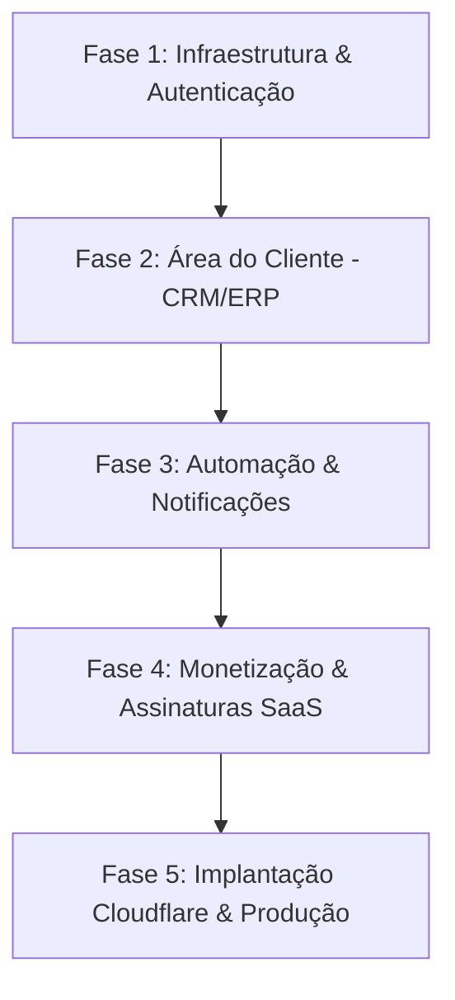

# 🚀 NexaERP (Gest Pro CRM) - Roadmap de Desenvolvimento

> **Status do Projeto:** MVP Frontend em desenvolvimento (Next.js 16 + React 19 + Tailwind CSS)  
> **Objetivo:** Plataforma SaaS Multi-tenant de Gestão e CRM para pequenos comércios e negócios locais.

---

## 📌 1. Diagnóstico do Estado Atual

### ✅ O que já está implementado:
- **Landing Page Comercial:** Interface moderna, responsiva, cards de recursos e rodapé ([`app/page.tsx`](file:///C:/Users/Renan/Desktop/Nexaerp/app/page.tsx)).
- **Autenticação & Onboarding (UI):**
  - Páginas de Login ([`app/login/page.tsx`](file:///C:/Users/Renan/Desktop/Nexaerp/app/login/page.tsx)), Recuperação e Alteração de Senha.
  - Cadastro de Empresa ([`app/register/page.tsx`](file:///C:/Users/Renan/Desktop/Nexaerp/app/register/page.tsx)) com busca dinâmica de CEP via ViaCEP API.
  - Checkout / Escolha de Planos e Pagamento ([`app/payment/page.tsx`](file:///C:/Users/Renan/Desktop/Nexaerp/app/payment/page.tsx)).
- **Painel SuperAdmin:**
  - Gestão de Licenças e Empresas ([`app/Admin/page.tsx`](file:///C:/Users/Renan/Desktop/Nexaerp/app/Admin/page.tsx)).
  - Métricas e Gráficos do Sistema ([`app/Admin/Estatisticas/page.tsx`](file:///C:/Users/Renan/Desktop/Nexaerp/app/Admin/Estatisticas/page.tsx)).
  - Gestão de Receitas e Faturamento SaaS ([`app/Admin/Receitas/page.tsx`](file:///C:/Users/Renan/Desktop/Nexaerp/app/Admin/Receitas/page.tsx)).
  - Configurações do Sistema SuperAdmin ([`app/Admin/gear/page.tsx`](file:///C:/Users/Renan/Desktop/Nexaerp/app/Admin/gear/page.tsx)).

### ⚠️ Principais Gaps / O que falta para a versão 1.0:
1. **Banco de Dados & Backend:** As informações atualmente usam dados fictícios (*mock*) e `useState`. Falta a camada de persistência.
2. **Autenticação & Permissões Reais:** Falta a integração com JWT / NextAuth / Supabase Auth e middlewares de proteção de rotas (`/Admin`, `/dashboard`).
3. **Área do Cliente (ERP/CRM Tenant):** O painel para o pequeno comerciante (restaurante, barbearia, loja) utilizar no dia a dia (cadastrar seus clientes, registrar atendimentos, histórico de compras, estoque) ainda não foi construído.
4. **Gateway de Pagamento:** Conectar o formulário de pagamento com um provedor real (Mercado Pago, Asaas, Stripe, etc.) e processamento de Webhooks.

---

## 🗺️ 2. Roadmap Detalhado por Fases

---

### 🔹 Fase 1: Fundação Backend & Autenticação Multi-tenant
*Prazo estimado: 1 a 2 semanas*

- [ ] **Modelagem do Banco de Dados Relacional:**
  - **Tabelas Principais:** `Tenants` (Empresas), `Users` (Usuários), `Clients` (Clientes da empresa), `Sales/Orders` (Vendas/Atendimentos), `Subscriptions` (Assinaturas SaaS), `Logs`.
  - **Escolha da Stack:** Drizzle ORM / Prisma com PostgreSQL (Supabase/Neon) ou Cloudflare D1.
- [ ] **Sistema de Autenticação Seguro:**
  - Implementar login e cadastro com hash de senha (Bcrypt/Argon2) ou Supabase Auth / Auth.js.
  - Controle de Acesso Baseado em Funções (RBAC): `SUPERADMIN`, `TENANT_ADMIN` (Gerente), `ATTENDANT` (Atendente), `SELLER` (Vendedor).
- [ ] **Middlewares Next.js:**
  - Proteger rotas da `/Admin` para acesso exclusivo do SuperAdmin.
  - Proteger a área de clientes (`/dashboard` ou `/[tenantSlug]`).

---

### 🔹 Fase 2: Área do Cliente (CRM & Gestão do Comércio Local)
*Prazo estimado: 2 a 3 semanas*

- [ ] **Dashboard do Lojista (`/dashboard`):**
  - Resumo de atendimentos do dia, vendas realizadas, clientes atendidos, aniversariantes do mês.
- [ ] **Módulo Cadastro e Gestão de Clientes:**
  - Formulário completo de clientes (Nome, WhatsApp, E-mail, Data de Nascimento, Preferências, Endereço).
  - Histórico timeline de interações e compras de cada cliente.
- [ ] **Módulo Registro de Atendimentos & Vendas:**
  - Interface simples de PDV / Atendimento rápido para balcão/atendente.
  - Status do pedido (Pendente, Em Atendimento, Concluído, Cancelado).
- [ ] **Módulo Produtos & Serviços:**
  - Cadastro de serviços (ex: Corte de Cabelo, Barba) e produtos (ex: Bebidas, Itens de consumo).

---

### 🔹 Fase 3: Engajamento & Automações
*Prazo estimado: 1 a 2 semanas*

- [ ] **Integração de Notificações WhatsApp / SMS / E-mail:**
  - Lembretes automáticos para retornos e agendamentos.
  - Mensagens automáticas de parabéns/promoções para aniversariantes.
- [ ] **Relatórios para o Lojista:**
  - Clientes mais frequentes (Top VIPs), ticket médio, vendas por dia/semana/mês.
  - Clientes inativos (sem comprar há X dias) para campanhas de reengajamento.

---

### 🔹 Fase 4: Monetização & Assinaturas SaaS SuperAdmin
*Prazo estimado: 1 a 2 semanas*

- [ ] **Gateway de Pagamento (Asaas / Mercado Pago / Stripe):**
  - Integração de cobrança via Pix, Cartão de Crédito e Boleto no checkout ([`app/payment/page.tsx`](file:///C:/Users/Renan/Desktop/Nexaerp/app/payment/page.tsx)).
  - Configuração de Webhooks para renovação, bloqueio e cancelamento automático de licenças.
- [ ] **Painel SuperAdmin Dinâmico:**
  - Conectar as telas de [`/Admin`](file:///C:/Users/Renan/Desktop/Nexaerp/app/Admin/page.tsx), [`/Admin/Estatisticas`](file:///C:/Users/Renan/Desktop/Nexaerp/app/Admin/Estatisticas/page.tsx) e [`/Admin/Receitas`](file:///C:/Users/Renan/Desktop/Nexaerp/app/Admin/Receitas/page.tsx) com o banco de dados real.
  - Ações reais: Bloquear empresa, alterar plano, reenviar cobrança, gerar faturas.

---

### 🔹 Fase 5: Segurança, LGPD & Deploy Cloudflare
*Prazo estimado: 1 semana*

- [ ] **Conformidade com a LGPD:**
  - Termos de Uso e Política de Privacidade na landing page e cadastro.
  - Botão de exportação e anonimização de dados do cliente.
- [ ] **Deploy em Nuvem:**
  - Configurar pipeline de build via `@opennextjs/cloudflare` + Cloudflare Pages / Workers.
  - Domínio personalizado e certificados SSL.
- [ ] **Testes & Qualidade:**
  - Testes E2E dos fluxos de Login, Cadastro, Checkout e Registro de Venda.

---

## 🎯 Próximos Passos Imediatos Recomendados

1. **Escolher a solução de Banco de Dados:** (Recomendado: PostgreSQL no Supabase/Neon ou Cloudflare D1 com Drizzle ORM).
2. **Criar a estrutura da Área do Cliente:** Desenvolver a rota `/dashboard` para o pequeno comerciante utilizar o sistema.
3. **Conectar a Autenticação:** Substituir a validação simulada de login por tokens JWT / Sessão real.
